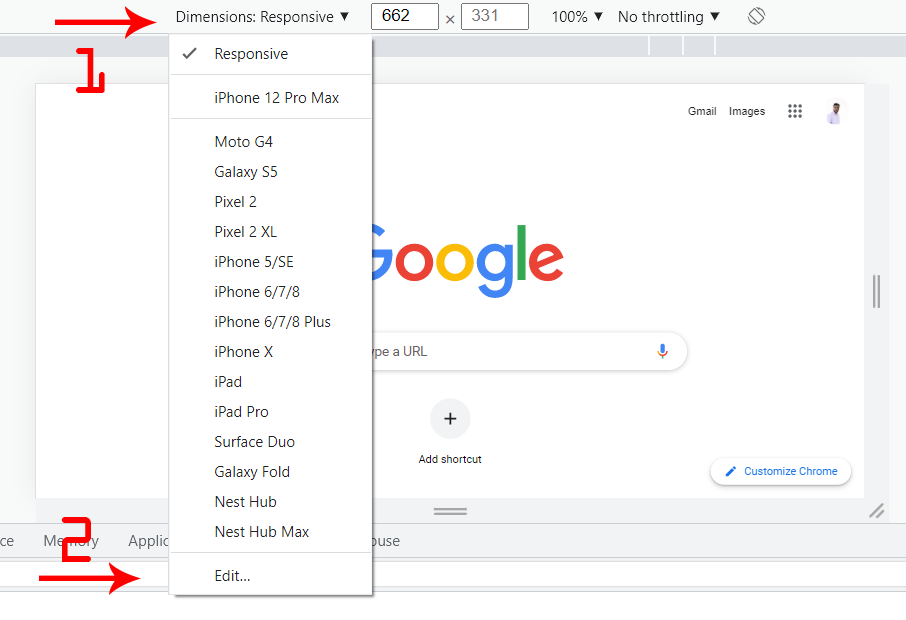
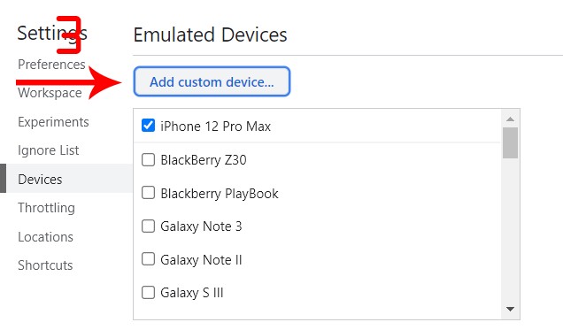
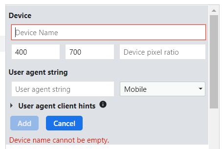
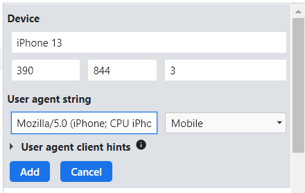
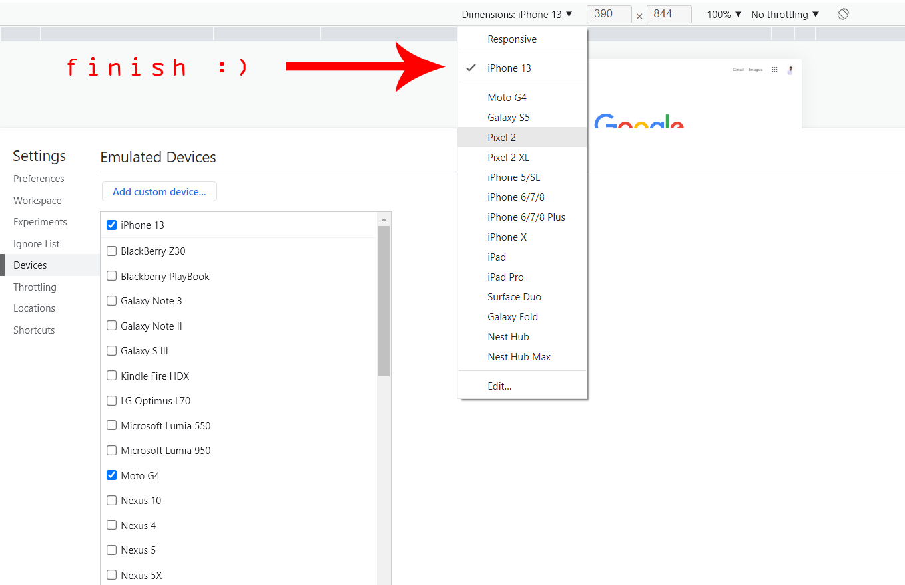

# custom-device-emulation-chrome
- add & edit something -> Fork & PR.
- Have You Problem ? [create Issue](https://github.com/amirshnll/custom-device-emulation-chrome/issues/new).
- [Send Feedback](mailto:amirsh.nll@gmail.com)

 

## Device Information

### Desktop

| Device Name | width (viewport) | height (viewport) | DPR (JS) - CSS Pixel Ratio | User Agent |
|---|---|---|---|---|
Apple MacBook 12-inch | 2304 | 1310 | 2 | - |
Apple MacBook Pro 13-inch | 2560 | 1470 | 2 | - |
Apple MacBook Pro 15-inch | 2880 | 1670 | 2 | - |
iMac 24 - 2021 | 2048 | 1152 | 2 | - |
Macbook PRO 16 - 2021 | 1728 | 1117 | 2 | - |
MacBook Air 13 - 2020 | 1280 | 800 | 2 | - |
MacBook Pro 16 - 2019 | 1536 | 960 | 2 | - |
MacBook Pro 13 - 2018 | 1280 | 800 | 2 | - |
MacBook Air 13 - 2018 | 1280 | 800 | 2 | - |
MacBook Pro 15 - 2018 | 1440 | 900 | 2 | - |
MacBook Pro 13 Pro - 2017 | 1440 | 900 | 2 | - |
MacBook Pro 15 Pro - 2017 | 1280 | 800 | 2 | - |
MacBook Pro 13 Pro - 2016 | 1280 | 800 | 2 | - |
MacBook Pro 15 Pro - 2016 | 1440 | 900 | 2 | - |
MacBook Pro 13 Pro - 2015 | 1280 | 800 | 2 | - |
MacBook Pro 15 Pro - 2015 | 1440 | 900 | 2 | - |
MacBook Pro 15 Pro - 2014 | 1440 | 900 | 2 | - |
Notebook with touch | 1280 | 950 | 1 | - |
Notebook with HiDPI screen | 1440 | 900 | 2 | - |
Dell Latitude 3420 14 | 1440 | 809 | 1 | - |
Microsoft Surface Duo | 1114 | 705 | 2.5 | - |
Generic notebook | 1280 | 800 | 1 | - |
Full HD | 1920 | 1080 | 1 | - |

### Tablet

| Device Name | width (viewport) | height (viewport) | DPR (JS) - CSS Pixel Ratio | User Agent |
|---|---|---|---|---|
Apple iPad Air 4 - 2020 | 1180 | 820 | 2 | - |
iPad 10.2" - 2019 | 810 | 1080 | 2 | Mozilla/5.0 (Macintosh; Intel Mac OS X 10_15) AppleWebKit/605.1.15 (KHTML, like Gecko) Version/13.0.3 Safari/605.1.15 |
iPad Mini 4 | 768 | 1024 | 2 | Mozilla/5.0 (iPad; CPU OS 11_1 like Mac OS X) AppleWebKit/604.3.5 (KHTML, like Gecko) Version/11.0 Mobile/15B93 Safari/604.1 |
iPad Pro (10.5") | 834 | 1112 | 2 | Mozilla/5.0 (iPad; CPU OS 11_1 like Mac OS X) AppleWebKit/604.3.5 (KHTML, like Gecko) Version/11.0 Mobile/15B101 Safari/604.1 |
iPad Pro (12.9") | 1024 | 1366 | 2 | Mozilla/5.0 (iPad; CPU OS 11_1 like Mac OS X) AppleWebKit/604.3.5 (KHTML, like Gecko) Version/11.0 Mobile/15B101 Safari/604.1 |
Apple iPad 1 / 2 / iPad Mini | 1024 | 768 | 1 | Mozilla/5.0 (iPad; CPU OS 4_3_5 like Mac OS X; en-us) AppleWebKit/533.17.9 (KHTML, like Gecko) Version/5.0.2 Mobile/8L1 Safari/6533.18.5 |
Apple iPad 3 / 4 | 1024 | 768 | 2 | Mozilla/5.0 (iPad; CPU OS 7_0 like Mac OS X) AppleWebKit/537.51.1 (KHTML, like Gecko) Version/7.0 Mobile/11A465 Safari/9537.53 |
Amazon Kindle Fire HDX 7″ | 1920 | 1200 | 2 | Mozilla/5.0 (Linux; U; en-us; KFTHWI Build/JDQ39) AppleWebKit/535.19 (KHTML, like Gecko) Silk/3.13 Safari/535.19 Silk-Accelerated=true |
Amazon Kindle Fire HDX 8.9″ | 2560 | 1600 | 2 | Mozilla/5.0 (Linux; U; en-us; KFAPWI Build/JDQ39) AppleWebKit/535.19 (KHTML, like Gecko) Silk/3.13 Safari/535.19 Silk-Accelerated=true |
Amazon Kindle Fire (First Generation) | 1024 | 600 | 1 | Mozilla/5.0 (Macintosh; U; Intel Mac OS X 10_6_3; en-us; Silk/1.0.141.16-Gen4_11004310) AppleWebkit/533.16 (KHTML, like Gecko) Version/5.0 Safari/533.16 Silk-Accelerated=true |

### Mobile

| Device Name | width (viewport) | height (viewport) | DPR (JS) - CSS Pixel Ratio | User Agent |
|---|---|---|---|---|
iPhone 15 Pro Max | 430 | 932 | 3 | - |
iPhone 15 Pro | 393 | 852 | 3 | - |
iPhone 15 Plus | 430 | 932 | 3 | - |
iPhone 15 | 393 | 852 | 3 | - |
iPhone 14 | 390 | 844 | 3 | Mozilla/5.0 (iPhone; CPU iPhone OS 16_0 like Mac OS X) AppleWebKit/605.1.15 (KHTML, like Gecko) CriOS/99.0.4844.47 Mobile/15E148 Safari/604.1 |
iPhone 14 Plus | 428 | 926 | 3 | Mozilla/5.0 (iPhone; CPU iPhone OS 16_0 like Mac OS X) AppleWebKit/605.1.15 (KHTML, like Gecko) CriOS/99.0.4844.47 Mobile/15E148 Safari/604.1 |
iPhone 14 Pro | 393 | 852 | 3 | Mozilla/5.0 (iPhone; CPU iPhone OS 16_0 like Mac OS X) AppleWebKit/605.1.15 (KHTML, like Gecko) CriOS/99.0.4844.47 Mobile/15E148 Safari/604.1 |
iPhone 14 Pro Max | 430 | 932 | 3 | Mozilla/5.0 (iPhone; CPU iPhone OS 16_0 like Mac OS X) AppleWebKit/605.1.15 (KHTML, like Gecko) CriOS/99.0.4844.47 Mobile/15E148 Safari/604.1 |
iPhone 13 Pro Max | 428 | 926 | 3 | Mozilla/5.0 (iPhone; CPU iPhone OS 15_0_2 like Mac OS X) AppleWebKit/605.1.15 (KHTML, like Gecko) Version/11.2 Mobile/15E148 Safari/604.1 |
iPhone 13 Pro | 390 | 844 | 3 | Mozilla/5.0 (iPhone; CPU iPhone OS 15_0_2 like Mac OS X) AppleWebKit/605.1.15 (KHTML, like Gecko) Version/11.2 Mobile/15E148 Safari/604.1 |
iPhone 13 | 390 | 844 | 3 | Mozilla/5.0 (iPhone; CPU iPhone OS 15_0_2 like Mac OS X) AppleWebKit/605.1.15 (KHTML, like Gecko) Version/11.2 Mobile/15E148 Safari/604.1 |
iPhone 13 mini | 375 | 812 | 3 | Mozilla/5.0 (iPhone; CPU iPhone OS 15_0_2 like Mac OS X) AppleWebKit/605.1.15 (KHTML, like Gecko) Version/11.2 Mobile/15E148 Safari/604.1 |
iPhone 12 Pro Max | 428 | 926 | 3 | Mozilla/5.0 (iPhone; CPU iPhone OS 15_0_2 like Mac OS X) AppleWebKit/605.1.15 (KHTML, like Gecko) Version/11.2 Mobile/15E148 Safari/604.1 |
iPhone 12 Pro | 390 | 844 | 3 | Mozilla/5.0 (iPhone; CPU iPhone OS 15_0_2 like Mac OS X) AppleWebKit/605.1.15 (KHTML, like Gecko) Version/11.2 Mobile/15E148 Safari/604.1 |
iPhone 12 | 390 | 844 | 3 | Mozilla/5.0 (iPhone; CPU iPhone OS 15_0_2 like Mac OS X) AppleWebKit/605.1.15 (KHTML, like Gecko) Version/11.2 Mobile/15E148 Safari/604.1 |
iPhone 12 mini | 360 | 780 | 3 | Mozilla/5.0 (iPhone; CPU iPhone OS 15_0_2 like Mac OS X) AppleWebKit/605.1.15 (KHTML, like Gecko) Version/11.2 Mobile/15E148 Safari/604.1 |
iPhone 11 | 414 | 896 | 2 | Mozilla/5.0 (iPhone; CPU iPhone OS 13_3 like Mac OS X) AppleWebKit/605.1.15 (KHTML, like Gecko) Version/13.0.4 Mobile/15E148 Safari/604.1 |
iPhone 11 Pro | 375 | 812 | 3 | Mozilla/5.0 (iPhone; CPU iPhone OS 13_3 like Mac OS X) AppleWebKit/605.1.15 (KHTML, like Gecko) Version/13.0.4 Mobile/15E148 Safari/604.1 |
iPhone 11 Pro Max | 414 | 896 | 3 | Mozilla/5.0 (iPhone; CPU iPhone OS 13_2 like Mac OS X) AppleWebKit/605.1.15 (KHTML, like Gecko) Version/13.0.3 Mobile/15E148 Safari/604.1 |
iPhone Xs | 375 | 812 | 3 | Mozilla/5.0 (iPhone; CPU iPhone OS 12_0 like Mac OS X) AppleWebKit/605.1.15 (KHTML, like Gecko) Version/12.0 Mobile/15E148 Safari/604.1 |
iPhone Xs Max | 414 | 896 | 3 | Mozilla/5.0 (iPhone; CPU iPhone OS 12_0 like Mac OS X) AppleWebKit/605.1.15 (KHTML, like Gecko) Version/12.0 Mobile/15E148 Safari/604.1 |
iPhone XR | 414 | 896 | 2 | Mozilla/5.0 (iPhone; CPU iPhone OS 12_0 like Mac OS X) AppleWebKit/605.1.15 (KHTML, like Gecko) Version/12.0 Mobile/15E148 Safari/604.1 |
iPhone X | 375 | 812 | 3 | Mozilla/5.0 (iPhone; CPU iPhone OS 11_1 like Mac OS X) AppleWebKit/604.3.5 (KHTML, like Gecko) Version/11.0 Mobile/15B93 Safari/604.1 |
iPhone 8 Plus | 414 | 736 | 3 | Mozilla/5.0 (iPhone; CPU iPhone OS 11_1 like Mac OS X) AppleWebKit/604.3.5 (KHTML, like Gecko) Version/11.0 Mobile/15B93 Safari/604.1 |
iPhone 8 | 375 | 667 | 2 | Mozilla/5.0 (iPhone; CPU iPhone OS 11_1 like Mac OS X) AppleWebKit/604.3.5 (KHTML, like Gecko) Version/11.0 Mobile/15B93 Safari/604.1 |
iPhone 7 Plus | 414 | 736 | 3 | Mozilla/5.0 (iPhone; CPU iPhone OS 11_1_1 like Mac OS X) AppleWebKit/604.3.5 (KHTML, like Gecko) Version/11.0 Mobile/15B150 Safari/604.1 |
iPhone 7 | 375 | 667 | 2 | Mozilla/5.0 (iPhone; CPU iPhone OS 11_1_1 like Mac OS X) AppleWebKit/603.1.30 (KHTML, like Gecko) Version/11.0 Mobile/14E304 Safari/604.1 |
iPhone SE | 320 | 568 | 2 | Mozilla/5.0 (iPhone; CPU iPhone OS 9_3 like Mac OS X) AppleWebKit/601.1.46 (KHTML, like Gecko) Version/9.0 Mobile/13E233 Safari/601.1 |
Apple iPhone 3GS | 320 | 480 | 1 | Mozilla/5.0 (iPhone; U; CPU iPhone OS 4_2_1 like Mac OS X; en-us) AppleWebKit/533.17.9 (KHTML, like Gecko) Version/5.0.2 Mobile/8C148 Safari/6533.18.5 |
Apple iPhone 4 | 320 | 480 | 2 | Mozilla/5.0 (iPhone; U; CPU iPhone OS 4_2_1 like Mac OS X; en-us) AppleWebKit/533.17.9 (KHTML, like Gecko) Version/5.0.2 Mobile/8C148 Safari/6533.18.5 |
Apple iPhone 5 | 320 | 568 | 2 | Mozilla/5.0 (iPhone; CPU iPhone OS 7_0 like Mac OS X; en-us) AppleWebKit/537.51.1 (KHTML, like Gecko) Version/7.0 Mobile/11A465 Safari/9537.53 |
Apple iPhone 6 | 375 | 667 | 2 | Mozilla/5.0 (iPhone; CPU iPhone OS 8_0 like Mac OS X) AppleWebKit/600.1.3 (KHTML, like Gecko) Version/8.0 Mobile/12A4345d Safari/600.1.4 |
Apple iPhone 6 Plus | 414 | 736 | 3 | Mozilla/5.0 (iPhone; CPU iPhone OS 8_0 like Mac OS X) AppleWebKit/600.1.3 (KHTML, like Gecko) Version/8.0 Mobile/12A4345d Safari/600.1.4 |
Red Hydrogen One | 412 | 732 | 3.5 | Mozilla/5.0 (Linux; Android 8.1.0; H1A1000 Build/H1A1000.010ho.01.01.01r.089) AppleWebKit/537.36 (KHTML, like Gecko) Chrome/68.0.3440.91 Mobile Safari/537.36 |
Xiaomi Mi 11i | 360 | 800 | 3 | - |
Xiaomi 12 - 2022 | 360 | 800 | 3 | - |
Huawei P30 PRO | 360 | 780 | 3 | - |
OnePlus Nord 2 | 412 | 915 | 2.625 | - |
OPPO Find X3 PRO | 360 | 804 | 4 | - |
Samsung Galaxy S22+ - 2022 | 360 | 780 | 3 | - |
Samsung Galaxy S22 ULTRA - 2022 | 360 | 772 | 4 | - |
Samsung Galaxy S22 - 2022 | 360 | 780 | 3 | - |
Samsung Galaxy S21 Ultra | 360 | 800 | 4 | - |
Samsung Galaxy A12 | 360 | 800 | 2 | - |
Samsung Galaxy Z Flip3 - 2021 | 360 | 880 | 3 | - |
Samsung Galaxy Fold | 586 | 820 | 2.625 | Mozilla/5.0 (Linux; Android 9; SM-F900U1) AppleWebKit/537.36 (KHTML, like Gecko) Chrome/79.0.3945.93 Mobile Safari/537.36 |
Samsung Galaxy Note10 | 412 | 869 | 2.625 | Mozilla/5.0 (Linux; Android 9; SM-N970XU) AppleWebKit/537.36 (KHTML, like Gecko) Chrome/79.0.3945.93 Mobile Safari/537.36 |
Samsung Galaxy Note10+ | 412 | 869 | 3.5 | Mozilla/5.0 (Linux; Android 9; SAMSUNG SM-N975XU) AppleWebKit/537.36 (KHTML, like Gecko) SamsungBrowser/10.2 Chrome/71.0.3578.99 Mobile Safari/537.36 |
Samsung Galaxy A51/71 | 412 | 737 | 2.63 | Mozilla/5.0 (Linux; Android 12; SAMSUNG SM-A515F) AppleWebKit/537.36 (KHTML, like Gecko) SamsungBrowser/18.0 Chrome/99.0.4844.88 Mobile Safari/537.36 |
Samsung Galaxy A20 | 980 | 1734 | 2.25 | Mozilla/5.0 (Linux; Android 9; SM-A205U) AppleWebKit/537.36 (KHTML, like Gecko) Chrome/79.0.3945.93 Mobile Safari/537.36 |
Samsung Galaxy A23 | 384 | 714 | 2.81 | Mozilla/5.0 (Linux; Android 13) AppleWebKit/537.36 (KHTML, like Gecko) Chrome/113.0.0.0 Mobile Safari/537.36 |
Samsung Galaxy S10 | 412 | 869 | 3.5 | Mozilla/5.0 (Linux; Android 9; SM-G973U) AppleWebKit/537.36 (KHTML, like Gecko) Chrome/72.0.3626.105 Mobile Safari/537.36 |
Samsung Galaxy S10+ | 412 | 869 | 3.5 | Mozilla/5.0 (Linux; Android 9; SM-G975U) AppleWebKit/537.36 (KHTML, like Gecko) Chrome/72.0.3626.105 Mobile Safari/537.36 |
Samsung Galaxy S10e | 360 | 760 | 3 | Mozilla/5.0 (Linux; Android 9; SM-G970U) AppleWebKit/537.36 (KHTML, like Gecko) Chrome/72.0.3626.105 Mobile Safari/537.36 |
Samsung Galaxy S9 | 360 | 740 | 3 | Mozilla/5.0 (Linux; Android 8.0.0; SM-G960U Build/R16NW) AppleWebKit/537.36 (KHTML, like Gecko) Chrome/63.0.3239.111 Mobile Safari/537.36 |
Samsung Galaxy S9+ | 320 | 658 | 4.5 | Mozilla/5.0 (Linux; Android 8.0.0; SM-G965U Build/R16NW) AppleWebKit/537.36 (KHTML, like Gecko) Chrome/63.0.3239.111 Mobile Safari/537.36 |
Samsung Galaxy Note 9 | 412 | 846 | 3.5 | Mozilla/5.0 (Linux; Android 8.1.0; SM-N960U Build/M1AJQ) AppleWebKit/537.36 (KHTML, like Gecko) Chrome/68.0.3440.91 Mobile Safari/537.36 |
Samsung Galaxy Note 3 | 360 | 640 | 3 | Mozilla/5.0 (Linux; U; Android 4.3; en-us; SM-N900T Build/JSS15J) AppleWebKit/534.30 (KHTML, like Gecko) Version/4.0 Mobile Safari/534.30 |
Samsung Galaxy Note II | 360 | 640 | 2 | Mozilla/5.0 (Linux; U; Android 4.1; en-us; GT-N7100 Build/JRO03C) AppleWebKit/534.30 (KHTML, like Gecko) Version/4.0 Mobile Safari/534.30 |
Samsung Galaxy Note | 400 | 640 | 2 | Mozilla/5.0 (Linux; U; Android 2.3; en-us; SAMSUNG-SGH-I717 Build/GINGERBREAD) AppleWebKit/533.1 (KHTML, like Gecko) Version/4.0 Mobile Safari/533.1 |
Samsung Galaxy S III, Galaxy Nexus | 360 | 640 | 2 | Mozilla/5.0 (Linux; U; Android 4.0; en-us; GT-I9300 Build/IMM76D) AppleWebKit/534.30 (KHTML, like Gecko) Version/4.0 Mobile Safari/534.30 |
Samsung Galaxy S, S II, W | 320 | 533 | 1.5 | Mozilla/5.0 (Linux; U; Android 2.1; en-us; GT-I9000 Build/ECLAIR) AppleWebKit/525.10+ (KHTML, like Gecko) Version/3.0.4 Mobile Safari/523.12.2 |
Samsung Galaxy S4 | 360 | 640 | 3 | Mozilla/5.0 (Linux; Android 4.2.2; GT-I9505 Build/JDQ39) AppleWebKit/537.36 (KHTML, like Gecko) Chrome/31.0.1650.59 Mobile Safari/537.36 |
Samsung Galaxy Tab S3 | 768 | 1024 | 2 | Mozilla/5.0 (Linux; Android 7.0; SM-T827V Build/NRD90M) AppleWebKit/537.36 (KHTML, like Gecko) Chrome/58.0.3029.83 Safari/537.36 |
Samsung Galaxy Tab S4 | 1138 | 712 | 2.25 | Mozilla/5.0 (Linux; Android 8.1.0; SM-T837A) AppleWebKit/537.36 (KHTML, like Gecko) Chrome/70.0.3538.80 Safari/537.36 |
Samsung Galaxy Tab 7.7, 8.9, 10.1 | 1280 | 800 | 1 | Mozilla/5.0 (Linux; U; Android 2.2; en-us; SCH-I800 Build/FROYO) AppleWebKit/533.1 (KHTML, like Gecko) Version/4.0 Mobile Safari/533.1 |
Samsung Galaxy Tab | 1024 | 600 | 1 | Mozilla/5.0 (Linux; U; Android 2.2; en-us; SCH-I800 Build/FROYO) AppleWebKit/533.1 (KHTML, like Gecko) Version/4.0 Mobile Safari/533.1 |
Samsung Galaxy Note 8 | 412 | 846 | 3.5 | Mozilla/5.0 (Linux; Android 7.1.1; SAMSUNG SM-N950U Build/NMF26X) AppleWebKit/537.36 (KHTML, like Gecko) SamsungBrowser/6.2 Chrome/56.0.2924.87 Mobile Safari/537.36 |
Samsung Galaxy S8 | 360 | 740 | 3 | Mozilla/5.0 (Linux; Android 7.0; SM-G950U Build/NRD90M) AppleWebKit/537.36 (KHTML, like Gecko) Chrome/62.0.3202.84 Mobile Safari/537.36 |
Samsung Galaxy S8+ | 412 | 846 | 3.5 | Mozilla/5.0 (Linux; Android 7.0; SM-G955U Build/NRD90M) AppleWebKit/537.36 (KHTML, like Gecko) Chrome/62.0.3202.84 Mobile Safari/537.36 |
Samsung Galaxy S7 | 360 | 640 | 4 | Mozilla/5.0 (Linux; Android 6.0.1; SM-G935V Build/MMB29M) AppleWebKit/537.36 (KHTML, like Gecko) Chrome/58.0.3029.83 Mobile Safari/537.36 |
Google Pixel 4 | 353 | 745 | 3 | Mozilla/5.0 (Linux; Android 10; Pixel 4) AppleWebKit/537.36 (KHTML, like Gecko) Chrome/81.0.4044.138 Mobile Safari/537.36 |
Google Pixel 4 XL | 412 | 869 | 3.5 | Mozilla/5.0 (Linux; Android 10; Pixel 4 XL) AppleWebKit/537.36 (KHTML, like Gecko) Chrome/78.0.3904.108 Mobile Safari/537.36 |
Google Pixel 3 | 393 | 786 | 2.75 | Mozilla/5.0 (Linux; Android 9; Pixel 3 Build/PQ1A.181105.017.A1) AppleWebKit/537.36 (KHTML, like Gecko) Chrome/66.0.3359.158 Mobile Safari/537.36 |
Google Pixel 3 XL | 412 | 846 | 3.5 | Mozilla/5.0 (Linux; Android 9; Pixel 3 XL Build/PQ1A.181105.017.A1) AppleWebKit/537.36 (KHTML, like Gecko) Chrome/66.0.3359.158 Mobile Safari/537.36 |
Google Nexus 4 | 384 | 640 | 2 | Mozilla/5.0 (Linux; Android 4.2.1; en-us; Nexus 4 Build/JOP40D) AppleWebKit/535.19 (KHTML, like Gecko) Chrome/18.0.1025.166 Mobile Safari/535.19 |
Google Nexus 5 | 360 | 640 | 3 | Mozilla/5.0 (Linux; Android 4.2.1; en-us; Nexus 5 Build/JOP40D) AppleWebKit/535.19 (KHTML, like Gecko) Chrome/18.0.1025.166 Mobile Safari/535.19 |
Google Nexus S | 320 | 533 | 1.5 | Mozilla/5.0 (Linux; U; Android 2.3.4; en-us; Nexus S Build/GRJ22) AppleWebKit/533.1 (KHTML, like Gecko) Version/4.0 Mobile Safari/533.1 |
Google Nexus 10 | 1280 | 800 | 2 | Mozilla/5.0 (Linux; Android 4.3; Nexus 10 Build/JSS15Q) AppleWebKit/537.36 (KHTML, like Gecko) Chrome/29.0.1547.72 Safari/537.36 |
Google Nexus 7 2 | 960 | 600 | 2 | Mozilla/5.0 (Linux; Android 4.3; Nexus 7 Build/JSS15Q) AppleWebKit/537.36 (KHTML, like Gecko) Chrome/29.0.1547.72 Safari/537.36 |
Google Nexus 7 | 966 | 604 | 1.325 | Mozilla/5.0 (Linux; Android 4.3; Nexus 7 Build/JSS15Q) AppleWebKit/537.36 (KHTML, like Gecko) Chrome/29.0.1547.72 Safari/537.36 |
Palm PVG100 | 360 | 640 | 2 | Mozilla/5.0 (Linux; Android 8.1.0; PVG100 Build/OPM1.171019.019) AppleWebKit/537.36 (KHTML, like Gecko) Chrome/66.0.3359.126 Mobile Safari/537.36 |
BlackBerry Z10 | 384 | 640 | 2 | Mozilla/5.0 (BB10; Touch) AppleWebKit/537.10+ (KHTML, like Gecko) Version/10.0.9.2372 Mobile Safari/537.10+ |
BlackBerry Z30 | 360 | 640 | 2 | Mozilla/5.0 (BB10; Touch) AppleWebKit/537.10+ (KHTML, like Gecko) Version/10.0.9.2372 Mobile Safari/537.10+ |
BlackBerry PlayBook | 1024 | 600 | 1 | Mozilla/5.0 (PlayBook; U; RIM Tablet OS 2.1.0; en-US) AppleWebKit/536.2+ (KHTML like Gecko) Version/7.2.1.0 Safari/536.2+ |
HTC Evo, Touch HD, Desire HD, Desire | 320 | 533 | 1.5 | Mozilla/5.0 (Linux; U; Android 2.2; en-us; Sprint APA9292KT Build/FRF91) AppleWebKit/533.1 (KHTML, like Gecko) Version/4.0 Mobile Safari/533.1 |
HTC One X, EVO LTE | 360 | 640 | 2 | Mozilla/5.0 (Linux; Android 4.0.3; HTC One X Build/IML74K) AppleWebKit/535.19 (KHTML, like Gecko) Chrome/18.0.1025.133 Mobile Safari/535.19 |
HTC Sensation, Evo 3D | 360 | 640 | 1.5 | Mozilla/5.0 (Linux; U; Android 4.0.3; en-us; HTC Sensation Build/IML74K) AppleWebKit/534.30 (KHTML, like Gecko) Version/4.0 Mobile Safari/534.30 |
LG Optimus 2X, Optimus 3D, Optimus Black | 320 | 533 | 1.5 | Mozilla/5.0 (Linux; U; Android 2.2; en-us; LG-P990/V08c Build/FRG83) AppleWebKit/533.1 (KHTML, like Gecko) Version/4.0 Mobile Safari/533.1 MMS/LG-Android-MMS-V1.0/1.2 |
LG Optimus G | 384 | 640 | 2 | Mozilla/5.0 (Linux; Android 4.0; LG-E975 Build/IMM76L) AppleWebKit/535.19 (KHTML, like Gecko) Chrome/18.0.1025.166 Mobile Safari/535.19 |
LG Optimus LTE, Optimus 4X HD | 424 | 753 | 1.7 | Mozilla/5.0 (Linux; U; Android 2.3; en-us; LG-P930 Build/GRJ90) AppleWebKit/533.1 (KHTML, like Gecko) Version/4.0 Mobile Safari/533.1 |
LG Optimus One | 213 | 320 | 1.5 | Mozilla/5.0 (Linux; U; Android 2.2.1; en-us; LG-MS690 Build/FRG83) AppleWebKit/533.1 (KHTML, like Gecko) Version/4.0 Mobile Safari/533.1 |
Motorola Defy, Droid, Droid X, Milestone | 320 | 569 | 1.5 | Mozilla/5.0 (Linux; U; Android 2.0; en-us; Milestone Build/ SHOLS_U2_01.03.1) AppleWebKit/530.17 (KHTML, like Gecko) Version/4.0 Mobile Safari/530.17 |
Motorola Droid 3, Droid 4, Droid Razr, Atrix 4G, Atrix 2 | 540 | 960 | 1 | Mozilla/5.0 (Linux; U; Android 2.2; en-us; Droid Build/FRG22D) AppleWebKit/533.1 (KHTML, like Gecko) Version/4.0 Mobile Safari/533.1 |
Motorola Droid Razr HD | 720 | 1280 | 1 | Mozilla/5.0 (Linux; U; Android 2.3; en-us; DROID RAZR 4G Build/6.5.1-73_DHD-11_M1-29) AppleWebKit/533.1 (KHTML, like Gecko) Version/4.0 Mobile Safari/533.1 |
Motorola Xoom, Xyboard | 1280 | 800 | 1 | Mozilla/5.0 (Linux; U; Android 3.0; en-us; Xoom Build/HRI39) AppleWebKit/525.10 (KHTML, like Gecko) Version/3.0.4 Mobile Safari/523.12.2 |
Nokia C5, C6, C7, N97, N8, X7 | 360 | 640 | 1 | NokiaN97/21.1.107 (SymbianOS/9.4; Series60/5.0 Mozilla/5.0; Profile/MIDP-2.1 Configuration/CLDC-1.1) AppleWebkit/525 (KHTML, like Gecko) BrowserNG/7.1.4 |
Nokia Lumia 7X0, Lumia 8XX, Lumia 900, N800, N810, N900 | 320 | 533 | 1.5 | Mozilla/5.0 (compatible; MSIE 10.0; Windows Phone 8.0; Trident/6.0; IEMobile/10.0; ARM; Touch; NOKIA; Lumia 820) |
Sony Xperia S, Ion | 360 | 640 | 2 | Mozilla/5.0 (Linux; U; Android 4.0; en-us; LT28at Build/6.1.C.1.111) AppleWebKit/534.30 (KHTML, like Gecko) Version/4.0 Mobile Safari/534.30 |
Sony Xperia Sola, U | 480 | 854 | 1 | Mozilla/5.0 (Linux; U; Android 2.3; en-us; SonyEricssonST25i Build/6.0.B.1.564) AppleWebKit/533.1 (KHTML, like Gecko) Version/4.0 Mobile Safari/533.1 |
Sony Xperia Z, Z1 | 360 | 640 | 3 | Mozilla/5.0 (Linux; U; Android 4.2; en-us; SonyC6903 Build/14.1.G.1.518) AppleWebKit/534.30 (KHTML, like Gecko) Version/4.0 Mobile Safari/534.30 |

 

## How To Add Custom Device on Chrome Emulation ?

### Video tutorial

 

### Step By Step tutorial
- Open Chrome
- Enter Shift + CTRL + I shortcut
- Enter Shift + CTRL + M shortcut
- Click "Dimentions"; Click "Edit" ...

  
- Click "add custom device"

- Enter Device Name, Width, Height, DPR (JS), User Agent and etc.

- click "add" button.

- Finish! Use it.

Be Happy 😃
