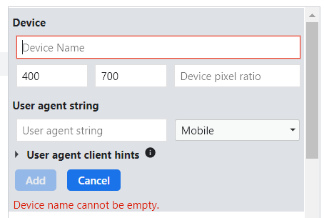
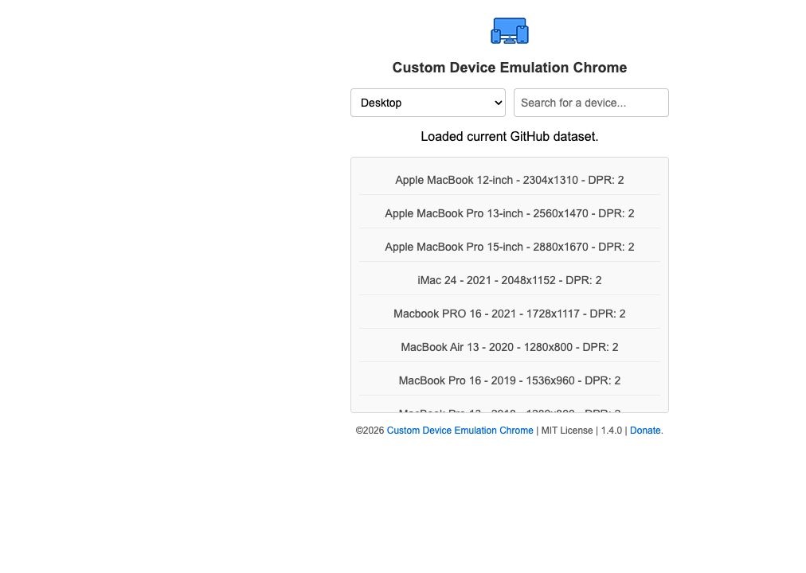

# Custom Device Emulation Chrome

**Device dimensions, pixel ratios and user agents for responsive testing in Chrome DevTools.** Find a preset, copy its values and add a custom device in Chrome.

[Browse the catalogue](#device-catalogue) · [Get the extension](#chrome-extension) · [Download JSON](device.json) · [Data quality](docs/data-quality.md)



## Quick start

1. Find your device in the [JSON dataset](device.json) or searchable catalogue below.
2. Open Chrome DevTools with **⌘⌥I** (macOS) or **Ctrl+Shift+I** (Windows/Linux).
3. Toggle the device toolbar with **⌘⇧M** or **Ctrl+Shift+M**.
4. Select **Dimensions → Edit → Add custom device**.
5. Enter the name, width, height and DPR. Choose the appropriate Mobile/Desktop type. User agent is optional; leave it blank when the dataset says `-`.
6. Click **Add**, then select the device from Dimensions.

Copy buttons copy text; they do not automatically import devices into Chrome.

## Device catalogue

The included website searches all devices, filters by device type and data quality, and copies settings or user agents. Each record shows its source and measurement notes.

Run from the repository root:

```sh
python3 scripts/build.py
python3 -m http.server 8000 --directory dist
```

Open http://localhost:8000. The website uses plain HTML, CSS and JavaScript, with no package installation. Serve it over HTTP; opening the HTML file directly cannot reliably load JSON.

The `dist/` directory is ready for static hosting. A private Sites preview is for the owner; a public catalogue link should be added here only after public hosting is enabled.

## Chrome extension

**Custom Device Emulation Chrome** puts searchable device dimensions in your Chrome toolbar.



1. Download this repository using **Code → Download ZIP**, then extract it (or clone it).
2. Open `chrome://extensions` and enable **Developer mode**.
3. Choose **Load unpacked** and select the extracted `plugin` folder.
4. Pin the extension and open it to search devices and view dimensions/DPR.

The extension displays presets; add them to DevTools using the quick start above. It reads the maintained dataset from GitHub, with a bundled offline fallback. No browsing-history permissions are requested. See the [privacy policy](plugin/privacy.md).

No Chrome Web Store listing is linked here because a verified listing has not been provided.

## Understand the data

- **Source checked:** compared with a cited preset; not physical-device verified.
- **Needs review:** historical community data with unknown source or measurement conditions.
- `screen-css` and `viewport-css` distinguish full screen dimensions from browser content dimensions.
- Desktop viewport depends on window size, display scaling and zoom. Historical desktop presets need review.
- A user agent string does not make Chrome emulate Safari. Device Mode is an approximation; test critical behavior on real hardware.

See the [measurement and maintenance policy](docs/data-quality.md), [official Chrome guide](https://developer.chrome.com/docs/devtools/device-mode), and [historical table](docs/legacy-device-table.md).

## Contribute a device

Include its source, measurement type and verification date. See [contributing](CONTRIBUTING.md). Found an incorrect preset? [Report it](https://github.com/amirshnll/custom-device-emulation-chrome/issues/new).

If this saves you time while testing, **star the repository** to help other developers find it.

## License

[MIT](LICENSE). Cited third-party preset sources retain their own licenses; see the data policy.
